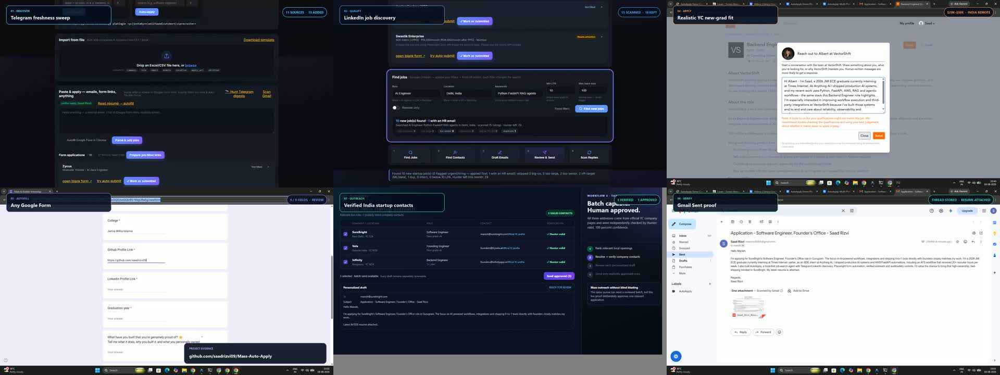

# AutoApply Cloud

AutoApply Cloud is a multi-user job-application workspace designed for Vercel and
Supabase. Each user signs in, uploads a private PDF résumé, maintains their own profile
and job pipeline, derives bounded public-job searches from that résumé, extracts public
contact leads already present in job records, drafts tailored outreach with an
account-scoped Groq key, connects Gmail through OAuth, reviews every message, and tracks
applications. User-supplied provider credentials are encrypted before service-role-only
persistence, so they follow the account across browsers without becoming browser data.

The hosted application is the supported product entrypoint. The earlier single-user
desktop implementation remains in the repository only as migration/reference code and
is never imported by the Vercel application.

## Watch the product demo

[](https://saadrizvi09.github.io/Mass-Auto-Apply/demo/autoapply-complete-product-demo.mp4)

### [▶ Watch the complete 1:48 product demo](https://saadrizvi09.github.io/Mass-Auto-Apply/demo/autoapply-complete-product-demo.mp4)

This 1 minute 48 second narrated walkthrough demonstrates Telegram and LinkedIn job
discovery, multi-platform applications, a verified YC application, Google Form autofill,
LinkedIn assisted apply, contact discovery, controlled email outreach, and sent-mail proof.

The video is hosted directly from this repository through GitHub Pages. If playback is
unavailable, [open the source MP4](./docs/demo/autoapply-complete-product-demo.mp4).

## Product capabilities

| Capability | Launch behavior |
|---|---|
| Authentication | Supabase email/password sign-up, confirmation, sign-in, reset, and sign-out, with Turnstile on public auth flows and recent sign-in enforcement for account deletion |
| Tenant isolation | Every user-owned database row and résumé object is protected by Supabase RLS |
| Résumés and profile facts | Up to five fixed private Storage slots, atomic registration/activation, PDF parsing, and conservative profile suggestions. A user-supplied public HTTPS résumé URL is stored separately from the private PDF; common graduation/passout questions use `graduation_year`, while recognized résumé/CV URL questions use only that public URL. |
| Groq | A per-user key is validated, encrypted with `TOKEN_ENCRYPTION_KEY`, and stored in the service-role-only `user_provider_credentials` table. API responses expose only safe status/hints; the key supports résumé-guided search planning, reviewed email drafts, and one automatic grounded suggestion request when an eligible Form Pilot revision loads. |
| Public contact leads | Contact discovery requires no provider key. It extracts syntactically valid addresses already present in public listings, referral text, CSV/XLSX imports, or a user-saved job record, and labels every candidate unverified. It never guesses addresses, probes SMTP/mailboxes, or sends verification mail. |
| Browserbase | A user may bring a Browserbase API key and Project ID. AutoApply validates the pair without creating a session, stores the encrypted pair per account, and prefers it for that user's browser work. Trusted deployment credentials are an optional platform fallback. |
| Discovery | Résumé-guided Groq terms for bounded Telegram/RSS filtering and LinkedIn guest search, full referral-digest parsing, CSV/XLSX imports, individual ATS URL detection, a review queue for discovered Google Forms, and bounded public-board enumeration |
| Jobs | Read-only library for imported/discovered roles, résumé-fit signals, URLs, archive/restore, and grounded draft actions. The duplicate manual job editor is removed. |
| Applications | Form Pilot owns Google Form scan, answer review, and one explicit **Approve & submit in background** action. The worker submits only the exact approved revision and reports success only after fresh provider confirmation; Browserbase Live View appears only when a run needs attention. Mass Cold Email separately handles external-AI workbook import, public-source contact review, Groq drafts, exact approval, and durable Gmail delivery. |
| Gmail | Google Web OAuth with `openid email profile gmail.send`; platform-managed by default, with an advanced per-user Web OAuth client option; encrypted credentials/tokens and disconnect/revoke |
| LinkedIn | Bounded unofficial guest-page discovery plus manual handoff; Easy Apply remains excluded unless an official candidate-apply partnership is obtained |
| Browser application work | One-page Google Forms use scan → exact answer review → explicit approval-bound background submit → verified confirmation. Unknown required fields, login/MFA/CAPTCHA, changed schema, or uncertain confirmation stop as `needs_attention`, with Live View offered only as a fallback. Greenhouse has an aligned managed-browser handler. Lever and Ashby mappings passed read-only live scan canaries but remain disabled pending controlled submit tests; Wellfound still needs its signed-in canary. YC has a finished exact-job state machine: the user saves one current public YC job URL, signs in through a tenant-isolated persistent Browserbase BYOK context, reviews résumé/Groq-grounded answers, and authorizes one sealed submit whose success must be provider-verified. It remains operator-allowlist gated until its signed-in canary passes. The generic exact-host company-form adapter remains an internal canary. Cutshort and Instahyre remain connection-only. |

LinkedIn guest discovery uses a bounded, throttled, unofficial public endpoint. It can
stop working if LinkedIn changes or blocks that endpoint, and it never signs a user in
or submits Easy Apply. LinkedIn login is not presented as application authorization:
LinkedIn OpenID Connect identifies a member but does not grant candidate Easy Apply
access. The product does not ship credential scraping, CAPTCHA bypass, or unsupported
LinkedIn application automation.

## Guided workflow

The primary sidebar journey is **Profile → Find jobs → Form Pilot → Mass Cold
Email**. The final destination contains two ordered subtabs: **Build campaign → Review
& send**.

1. **Profile:** complete the applicant profile, upload and parse an active résumé, and
   save an encrypted account-scoped Groq key.
2. **Find jobs:** `POST /api/v1/discovery/resume-guided` resolves the user's stored Groq
   credential server-side, derives bounded roles/keywords from the owned résumé/profile,
   and queues LinkedIn guest plus Telegram/RSS discovery. The worker applies the
   derived terms to Telegram/RSS candidates before saving them. LinkedIn remains an
   unofficial, best-effort guest source with no login or Easy Apply.
3. **Form Pilot:** paste a complete numbered referral message or one Google Form link.
   Stage 01 extracts Company, Role, Batch, compensation, location, application links,
   and application emails; ignores known channel/premium-promotion links; routes Google
   Forms into its preparation inbox; and makes email applications available in **Mass
   Cold Email**. After an explicit scan returns its immutable revision, the signed-in
   browser automatically applies exact saved Profile facts and asks Groq only for
   unresolved questions when a stored Groq credential is available. There is no duplicate
   AI-fill action. The user reviews the exact answers and chooses **Approve & submit in
   background** once. The API seals that immutable revision, verifies that every
   required answer is complete, and queues an idempotent submit. The worker fills only
   those sealed values and reports success only after it observes a fresh Google Forms
   confirmation. Live View is exposed only when the run stops at `needs_attention`;
   parsing, scanning, and suggestion generation never approve or submit by themselves.
4. **Mass Cold Email — Build campaign:** generate the résumé-bound external research
   prompt, paste it into Claude, ChatGPT, or Gemini, and upload the resulting CSV/XLSX
   workbook. The importer accepts exact job descriptions, public source URLs, named
   contacts, and publicly listed emails; it never guesses an address or probes a
   mailbox. Select up to 30 roles in the order you want to process, review any public
   contact lead, and ask Groq to create editable drafts from the JD and résumé.
   Open **Review & send** to review and approve each exact draft individually, then
   confirm the handoff. The API enqueues the approved messages and a persistent worker
   sends them after the browser closes. Database gates enforce the configured daily
   cap (150 maximum), duplicate-recipient window, and idempotency. This subtab lists
   email drafts only; Google Form revisions and answers remain in Form Pilot.

This workflow is a bounded, user-driven convenience layer. It is not an autonomous or
unreviewed bulk cold-email system; contact lookup, content approval, final confirmation,
and every provider send remain explicit.

## Discovery and application review

Users can bring jobs into their own workspace through credential-free public sources
and, for résumé-guided planning, an optional encrypted account-scoped Groq key:

- derive roles and keywords from the active parsed résumé with the stored Groq key,
  then queue both public-feed and LinkedIn guest searches;
- fetch configured Telegram public-channel previews and RSS feeds through bounded HTTP
  requests, filtering their results against those résumé-derived search terms when the
  guided flow is used;
- import CSV or XLSX files up to 4 MB with flexible job-column headings;
- detect supported public application providers from submitted URLs;
- enumerate published jobs from up to 8 official Greenhouse, Lever, or Ashby company
  boards through their credential-free public APIs; and
- run a deliberately bounded and throttled LinkedIn guest-job search.

The résumé-guided **Find matching jobs** form exposes a shared maximum of 5, 10, 20,
or 40 jobs and a 30-second, 60-second, or 2-minute worker time limit. The two queued
collectors share that result budget; the worker stops source collection at the deadline,
and the browser stops waiting and requests cancellation if the deadline is reached. A
worker must run continuously outside Vercel for queued discovery to complete.

**Form Pilot → Referral digest** exposes authenticated
`POST /api/v1/discovery/referrals`. It accepts the full Telegram, WhatsApp, or email
message rather than only a URL, splits numbered postings, extracts labeled Company,
Role, Batch, CTC/Stipend, and Location values, and preserves each useful form or email
application route. Known WhatsApp/channel/Topmate and premium-group promotion links are
ignored. Google Forms enter the Form Pilot queue; email-address applications become
saved jobs available to Mass Cold Email. The response reports routing counts, and no
scan, approval, submit, or send follows automatically.

`GET /api/v1/discovery/google-forms` builds a tenant-scoped, URL-deduplicated queue from
saved Google Forms jobs and form links found in saved-job metadata. Queue membership
does not start browser automation: the user must save a metadata-only form when needed
and request a scan. When that asynchronous scan returns, the browser automatically
requests grounded suggestions when the account has a Groq credential. The user
reviews the exact revision and explicitly approves it for background submission in one
action. A run is marked submitted only when the worker returns
`code=application_submitted` with `submission_state=confirmed`; otherwise it stops
visibly and may offer Live View for the user's attention.

Network discovery is durable worker work; paste/file normalization is a bounded ingest.
Every result is normalized, deduplicated per tenant, and shown for review. Public ATS
board discovery enumerates only the company-board URLs the user supplies; it is not an
internet-wide job-search engine. No LinkedIn account cookie or password is collected.
The 4 MB spreadsheet cap leaves margin under Vercel's Function payload limit. Résumé
PDFs still upload directly to Supabase Storage and keep their separate 6 MiB limit.

Application automation uses sealed form revisions. A scan records the exact fields,
résumé selection, and schema hash. When possible, the browser immediately asks the API for Groq
factual answer suggestions grounded in the owned profile, linked résumé, job, and
captured non-sensitive questions. The key never enters the worker queue, and the
suggestions never approve themselves. The first approval atomically
seals the exact answers the user reviewed. After sealing, any field, answer, résumé, or
schema change requires a new revision. For Google Forms, the normal path queues a
single approval-bound `application_submit` job. The worker revalidates the latest
revision and required-answer preflight, fills only the sealed answers, activates the
provider submit control once, and requires freshly observed confirmation. It does not
blindly retry an uncertain submit; that outcome becomes `needs_attention`.

### Exact YC job workflow

YC automation starts only from an exact, current public YC job-detail URL saved by the
user. Search pages, company listings, account pages, generic application URLs, and
historical/unsupported YC URL shapes are rejected as automation targets. AutoApply does
not crawl YC, discover YC jobs, or turn saved query, remote, or result-limit preferences
into provider requests; those optional preferences are organization and matching hints
only. Every root or subdomain of `ycombinator.com` and `workatastartup.com` is also
reserved from the generic company-form adapter, so a non-exact YC URL cannot bypass this
contract through a broader browser workflow.

The user signs in to YC inside a tenant-isolated Browserbase session created with that
account's Browserbase BYOK credential (or the explicitly configured trusted fallback).
The opaque persistent context is bound to the same account and provider so later runs
can reuse the user's cookies without collecting the YC password. A continuously running
worker outside Vercel connects Playwright to Browserbase, opens only the saved exact job,
and scans the visible application fields. Vercel serves the API/UI and queue endpoints;
it does not launch Chromium, control Browserbase, or run this worker.

The captured fields become an immutable review revision. Answers must be grounded in the
owned profile and résumé, with Groq used only for reviewable suggestions. Approval seals
that exact job, schema, answers, and résumé selection. The worker may activate one unique
submit control once and reports success only after a fresh YC confirmation. A changed
page, missing login, CAPTCHA/MFA, unknown required field, ambiguous control, or uncertain
confirmation fails closed as `needs_attention`; the worker never guesses or blindly
retries a potentially completed application.

The managed-browser registry contains exactly `google_forms`, `greenhouse`, `lever`,
`ashby`, `yc`, `wellfound`, `cutshort`, and `instahyre`, but registry membership does
not mean that all eight have an end-to-end application handler. Greenhouse and
one-page Google Forms are aligned; multi-page or branching Google Forms are unsupported.
Lever and Ashby have fail-closed mappings whose read-only live scans passed on
2026-08-11, but their submit-confirmation gates still require controlled test postings.
Wellfound still requires a signed-in canary. YC's exact-job state machine is implemented
but remains allowlist-gated until a controlled signed-in canary validates the current
provider behavior. The exact-host public company-form adapter remains an internal gated
canary and is not an enabled public capability. Cutshort and Instahyre support an isolated user
login/context only; their workers return `needs_attention` until tenant-aware multi-step
state machines are built and validated. ZipRecruiter is intentionally not part of the
hosted product. CAPTCHA,
MFA, login expiry, ambiguous confirmation, or an unrecognized required question also
produces `needs_attention`; the worker never bypasses or guesses through those
conditions.

Each account may own only `<user-id>/resume-1.pdf` through
`<user-id>/resume-5.pdf` in the private `resumes` bucket. The browser uploads directly;
the registration RPC then verifies that the owned object exists and transactionally
deactivates the previous active résumé while activating the selected slot. Deleting a
résumé removes that object and its résumé metadata, not the user's application history.

## Architecture

```text
Browser (public SPA)
  ├─ Supabase Auth session
  ├─ private direct résumé upload
   └─ non-authoritative outreach selection (maximum 30)
            │ bearer JWT
            ▼
Vercel FastAPI control plane
  ├─ validates the current Supabase user
  ├─ accesses tenant rows with the user's JWT/RLS
  ├─ resolves account-scoped encrypted Groq credentials just in time
  ├─ extracts tenant-owned public contact candidates without a contact API key
  ├─ ingests bounded paste/file discovery
  └─ manages Google OAuth and reviewed Gmail sends
            │
            ├─ Supabase Postgres + private Storage
            ├─ Groq (decrypted only for the owned request)
            └─ persistent worker
                 ├─ résumé-term-filtered Telegram/RSS + LinkedIn guest discovery
                 ├─ Greenhouse/Lever/Ashby public-board discovery
                 └─ Browserbase scan + exact-approved submit + verified confirmation
                    (user BYOK first; optional platform fallback)
```

No SQLite database, local browser profile, APScheduler job, or process-global user state
is used by `app.saas_main:app`.

### Account-scoped provider credentials

`GET /api/v1/provider-credentials` returns safe connection status and masked hints for
`groq` and `browserbase`. `PUT` and `DELETE`
`/api/v1/provider-credentials/{provider}` validate/replace or remove the authenticated
user's credential. The API encrypts a versioned JSON payload with
`TOKEN_ENCRYPTION_KEY` and writes only ciphertext to the service-role-only
`public.user_provider_credentials` table. Browser clients and authenticated database
roles cannot read that table, ciphertext, or plaintext, and no API response returns a
saved key.

During the upgrade from the former browser-local Groq design, the authenticated
frontend performs a one-time import of only the signed-in user's namespaced legacy
value through the same validated PUT endpoint. It removes a browser copy only after
the encrypted save succeeds; a failed import keeps the copy and shows a retry warning.
New credentials are never written to browser storage.

Browserbase BYOK requires an API key and Project ID. New users can
[create a free Browserbase account](https://www.browserbase.com/sign-up); existing
users can copy credentials from [Browserbase Settings](https://www.browserbase.com/settings)
or [Overview](https://www.browserbase.com/overview). Validation performs a read-only
`GET /v1/projects/{project_id}` with `X-BB-API-Key`, verifies the returned ID, and does
not create or charge a browser session. At execution time the worker prefers the
claimed job owner's Browserbase credential and uses `BROWSERBASE_API_KEY` plus
`BROWSERBASE_PROJECT_ID` only as an optional platform fallback.

The managed-browser stall cap is 90 seconds. Successful runs still close immediately,
so lowering this cap affects only stalled work. Browserbase applies a one-minute
minimum billing period to each created session; therefore a run that finishes in less
than one minute still consumes at least one browser minute. See Browserbase's
[cost-optimization guidance](https://docs.browserbase.com/optimizations/cost/cost-optimization),
[project validation API](https://docs.browserbase.com/reference/api/get-a-project), and
[current pricing](https://www.browserbase.com/pricing).

## Local cloud-mode setup

Use Python 3.12:

```bash
python3.12 -m venv .venv-saas
source .venv-saas/bin/activate
python -m pip install -r requirements-dev.txt
cp .env.example .env.saas.local
```

Create a Supabase project, apply the migration, and put development values in
`.env.saas.local`:

```bash
supabase link --project-ref YOUR_PROJECT_REF
supabase db push
set -a; source .env.saas.local; set +a
uvicorn app.saas_main:app --reload --host 127.0.0.1 --port 8000
```

Open <http://127.0.0.1:8000>. The health and public shell still load when configuration
is incomplete, and private/provider actions report which setup is missing.

## Google account login

**Continue with Google** uses Supabase Auth and creates the same Supabase session as
email/password sign-in. It requests identity scopes only; it does not grant Gmail
access. Configure it outside the application environment:

1. Create a Google OAuth client of type **Web application** and add the local and
   production origins under Authorized JavaScript origins.
2. Add the callback displayed by Supabase Authentication → Sign In / Providers →
   Google under Authorized redirect URIs. Hosted projects use
   `https://YOUR_PROJECT_REF.supabase.co/auth/v1/callback`.
3. Enable Google on that Supabase provider page and paste the Web client ID/secret.
4. Add `http://127.0.0.1:8000/**`, any preview URL pattern, and the exact production
   URL to Supabase Authentication → URL Configuration as appropriate.

No Google login secret belongs in `public/app.js` or an application environment
variable. The same Google Cloud project may contain the separate Gmail client below;
using separate Web clients makes their callbacks and scopes easier to audit.

## Google/Gmail sending setup

Normal users do not need a Google Cloud credential. When the deployment provides
`GOOGLE_CLIENT_ID` and `GOOGLE_CLIENT_SECRET`, **Connect Gmail** uses that
platform-managed OAuth client by default. The deployment operator owns its consent
screen, verification, quotas, and credential rotation.

An advanced user may instead bring a separate Google **Web application OAuth client**.
This is useful for a private deployment or a user who wants to own the Google project,
but it requires Google Cloud configuration:

1. [Create or select a Google Cloud project](https://console.cloud.google.com/projectcreate).
2. [Enable the Gmail API](https://console.cloud.google.com/apis/library/gmail.googleapis.com).
3. Configure [Branding](https://console.cloud.google.com/auth/branding),
   [Audience](https://console.cloud.google.com/auth/audience), and
   [Data Access](https://console.cloud.google.com/auth/scopes). Request only `openid`,
   `email`, `profile`, and `https://www.googleapis.com/auth/gmail.send`.
4. Open [Google Auth Platform → Clients](https://console.cloud.google.com/auth/clients),
   create an OAuth client, and select **Web application** (not Desktop). Copy the client
   ID and secret when Google shows them; the full secret may not be displayed again.
5. Register the single callback shown by AutoApply exactly. For this repository's local
   setup it is `http://127.0.0.1:8000/api/v1/oauth/google/callback`; production uses
   `https://YOUR_DOMAIN/api/v1/oauth/google/callback`. Scheme, host, port, path, and
   trailing-slash behavior must match `GOOGLE_REDIRECT_URI` exactly.
6. In AutoApply's Gmail connection panel, open the advanced user-managed option, paste
   the OAuth client ID and client secret, save them, select that credential source, and
   then connect the Gmail account.

A standard Google Cloud API key is not sufficient: Gmail authorization requires an
OAuth Web client ID/secret and a separate consent grant from the Gmail account. User
OAuth client credentials are encrypted before database storage, are accessible only to
the trusted server role, and are never returned to the browser after save. Disconnect
Gmail before replacing or deleting them. OAuth state records bind the selected
credential source and generation so a callback or later refresh cannot silently switch
clients.

For an External consent screen in **Testing**, add every Gmail account under **Test
users**. Because AutoApply requests `gmail.send`, a test user's authorization and
refresh token expire seven days after consent; reconnecting is expected. For public
production use, the Google-project owner must publish the app and complete brand/domain
and sensitive-scope verification for the exact production domain and scopes.

Whether using the default or advanced path, the user chooses the sender account,
reviews the requested send-only permission, and returns to AutoApply. Never ask for a
Gmail password, app password, `credentials.json`, desktop `token.json`, or API key.

OAuth start, callback, reconnect, and disconnect operations use a per-user generation
so an older callback cannot recreate a connection after a newer flow or disconnect.
Disconnect deletes the local encrypted token record and makes a best-effort Google
revocation request. If Google cannot confirm revocation, the UI instructs the user to
remove AutoApply from their Google Account as well.

To prevent account recreation from resetting send caps, the database retains
domain-separated SHA-256 hashes of the Google provider account and recipient alongside
a random send-event identifier. These rows contain no user ID, email address, message,
or OAuth token, and expire no later than 90 days after creation (normally sooner,
according to the configured duplicate-recipient window). They may therefore remain
briefly after account deletion solely for provider-level rate and duplicate prevention.
Expired rows stop participating in either control immediately; an hourly database job
and the next send-reservation hot path physically prune expired rows. Physical deletion
can lag if the cron job fails, so its run history is a production monitoring gate.

## Bot protection

AutoApply uses Cloudflare Turnstile through Supabase Auth for sign-in, sign-up, and
password-reset requests. Create a Turnstile widget for every exact staging/production
hostname, then use this rollout order so auth is not accidentally locked out:

1. Test the full configuration with a separate staging Supabase project.
2. Set the public `TURNSTILE_SITE_KEY` in the matching Vercel environment and deploy
   while Supabase CAPTCHA enforcement is still disabled.
3. Verify the widget loads under the deployed Content Security Policy and the public
   config reports CAPTCHA ready.
4. Put the matching Turnstile **secret** only in Supabase Authentication → Bot and
   Abuse Protection, then enable CAPTCHA.
5. Immediately test sign-in, sign-up, and password reset in a new browser session.

Never put the Turnstile secret in Vercel or browser code. Do not enable Supabase CAPTCHA
before the site-key deployment is live. See the
[Supabase CAPTCHA guide](https://supabase.com/docs/guides/auth/auth-captcha),
[Turnstile widget lifecycle](https://developers.cloudflare.com/turnstile/get-started/client-side-rendering/),
and [Turnstile CSP requirements](https://developers.cloudflare.com/turnstile/reference/content-security-policy/).

## Deploy to Vercel

Follow the complete, provider-by-provider
[Vercel production deployment checklist](docs/06-Vercel-Deployment-Checklist.md) before
adding a public domain or promoting a deployment.

The project uses Vercel's native FastAPI detection through
`[tool.vercel].entrypoint = "app.saas_main:app"`. Static files under `public/` are served
from Vercel's CDN.

Configure these Production and Preview variables:

```text
SUPABASE_URL
SUPABASE_PUBLISHABLE_KEY
SUPABASE_SECRET_KEY
SITE_URL
TURNSTILE_SITE_KEY
TOKEN_ENCRYPTION_KEY
GOOGLE_CLIENT_ID
GOOGLE_CLIENT_SECRET
GOOGLE_REDIRECT_URI
GROQ_MODEL
MAX_RESUME_BYTES
DEFAULT_DAILY_SEND_CAP
OAUTH_STATE_TTL_SECONDS
SUPABASE_HTTP_TIMEOUT_SECONDS
BROWSERBASE_API_KEY
BROWSERBASE_PROJECT_ID
ALLOWED_BROWSER_PROVIDERS
```

Keep the allowlist empty until controlled staging validation. The current initial
allowlist recommendation is exactly:

```text
ALLOWED_BROWSER_PROVIDERS=google_forms,greenhouse
```

Add `lever`, `ashby`, or `wellfound` individually only after its controlled canary has
passed. Leave `yc` out until a controlled signed-in exact-job canary proves the full
tenant-aware flow and current provider behavior; after it passes, use:

```text
ALLOWED_BROWSER_PROVIDERS=google_forms,greenhouse,yc
```

The generic
`company_form` adapter is also an internal exact-host canary and is not a public catalog
or allowlist entry. Leave `cutshort` and `instahyre` out until their tenant-aware
multi-step state machines exist and pass live staging. `google_forms` covers one-page
forms only.

The Browserbase values are optional platform fallback credentials for managed-browser
login and application jobs. An account's validated Browserbase BYOK pair takes
priority; if neither source exists, browser work fails closed as unavailable.
`GOOGLE_REDIRECT_URI` is the deployment's one fixed Gmail callback. The
`GOOGLE_CLIENT_ID` and `GOOGLE_CLIENT_SECRET` variables are optional only when every
Gmail user will configure the advanced user-managed client; setting both enables the
default platform-managed path. These values do not enable Supabase Google account
login and do not connect Google Forms.
`TOKEN_ENCRYPTION_KEY` is required for Gmail token storage, user-managed OAuth clients,
account-scoped Groq/Browserbase credentials, and encrypted provider context
identifiers. It must be identical in every trusted API/worker environment.

There is deliberately no `HUNTER_API_KEY` deployment variable or contact-provider
requirement. The legacy Hunter adapter/API remains disabled in the web UI for old
clients, while the active workflow uses only public/user-supplied job-record contacts.

Then deploy a preview and promote only after the runbook checks pass:

```bash
vercel link
vercel deploy
vercel deploy --prod
```

A code-complete deployment is not automatically launch-ready. Promotion remains
blocked until a real staging migration has passed RLS, Storage, send-reservation,
OAuth-generation, deletion, discovery-boundary, immutable-revision, and queue concurrency
tests; each enabled browser provider has passed a controlled Browserbase staging run;
the platform Google project has been verified for the exact production domain and
`gmail.send` scope before default public use (and user-managed project owners are shown
their equivalent Testing/verification obligations);
Vercel/Supabase/worker production configuration is verified; and the operator has
replaced every legal/support placeholder with reviewed, operator-specific terms,
privacy, deletion, and contact information.

`.vercelignore` excludes local secrets, PDFs, SQLite files, browser profiles,
screenshots, generated output, tests, legacy launchers, and the persistent worker from
the web-function bundle. Always deploy from a clean Git checkout rather than uploading
this working directory with its historical personal files.

## Persistent worker

Vercel hosts the short-lived control plane. Network discovery and browser automation
jobs are leased from Supabase by `worker/main.py`, which must run continuously on a
persistent-process host; a Vercel Function cannot replace it:

```bash
docker build -f worker/Dockerfile -t autoapply-worker .
docker run --env-file .env.worker autoapply-worker
```

The worker needs `SUPABASE_URL`, `SUPABASE_SECRET_KEY`, `TOKEN_ENCRYPTION_KEY`,
`WORKER_ID`, `WORKER_POLL_SECONDS`, `WORKER_MAX_IDLE_POLL_SECONDS`, and
`WORKER_LEASE_SECONDS`. If platform-managed Gmail is enabled, copy the same
`GOOGLE_CLIENT_ID` and `GOOGLE_CLIENT_SECRET` to the worker; advanced user-managed
OAuth clients are loaded from encrypted Supabase rows. It polls at the short interval
when work is active, backs off toward the idle ceiling after consecutive empty claims,
and resets immediately after a claim. Browser work additionally needs the exact provider
allowlist above and either an account-scoped Browserbase BYOK credential or the platform
fallback `BROWSERBASE_API_KEY`/`BROWSERBASE_PROJECT_ID`. Keep the allowlist
empty until staging has exercised Greenhouse and one-page Google Forms, then begin with
only those two entries.

For this public repository, `.github/workflows/queue-worker.yml` also provides a
bounded scheduler: it drains the same queue for four minutes every five minutes outside
Vercel. The repository's encrypted Actions secrets must contain the three required
`AUTOAPPLY_*` Supabase/encryption values; the two Google values are needed only when
platform-managed Gmail OAuth is enabled. A continuously running Docker worker remains
the preferred production host because GitHub scheduled runs can be delayed by the
platform.

The root `.dockerignore` is deny-by-default and sends only `worker/` plus the SaaS
modules copied by `worker/Dockerfile` to the build daemon. Keep that allowlist in sync
with Dockerfile `COPY` statements; never replace it with a broad build context on a
remote builder.

Code and mocked selectors cannot validate a live provider. Before public enablement the
operator must supply Browserbase credentials, a persistent worker host outside Vercel,
and controlled test accounts/jobs for every enabled provider. Keep-alive/Live View is an
attention fallback, not the normal Google Forms completion path. Users sign in or solve
MFA themselves inside Live View only when a run needs attention; neither the operator
nor AutoApply asks for their passwords.

## Tests

```bash
source .venv-saas/bin/activate
python -m pip install -r requirements-dev.txt
python -m pytest
```

The suite includes legacy pure-logic regression tests plus hosted schema, API,
encryption, provider, OAuth/MIME, PDF, résumé-guided discovery, Google Forms queue,
public-contact extraction, immutable form-revision, worker, outreach-send, and
tenant-boundary tests. Mocked provider tests do not replace the live staging gate.

## Documentation

- [Research and decision record](docs/00-Research-and-Decision-Record.md)
- [Product requirements](docs/01-PRD%20%281%29.md)
- [Software requirements](docs/02-SRS.md)
- [Architecture](docs/03-Architecture.md)
- [Technical specification](docs/04-Technical-Spec.md)
- [Build and launch runbook](docs/05-Build-Runbook.md)
- [Vercel deployment checklist](docs/06-Vercel-Deployment-Checklist.md)

The Apple Silicon launchers are documented in [README_MAC.md](README_MAC.md) and run the
same cloud-mode entrypoint locally. The earlier single-user application remains only as
reference code and uses `requirements-legacy.txt` when invoked explicitly.
