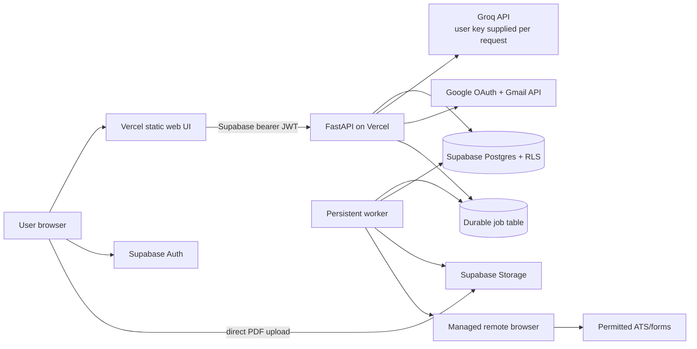

# AutoApply Cloud — Research and Decision Record

**Status:** Approved for implementation
**Date:** 2026-08-11; implementation contract updated 2026-08-13
**Scope:** Conversion of the local, single-user AutoApply application into a public,
multi-user product whose web control plane deploys to Vercel.

## Executive decision

The current application cannot be made public by deploying `app/main.py` unchanged.
Its SQLite database, root-level secrets, in-process scheduler, process globals, local
resume files, and persistent Chrome profile all assume one trusted operator and one
long-lived computer.

The product will use this topology:

Vercel is the public control plane. Supabase owns durable identity, relational data,
and files. Long-running or browser-driven work is claimed by a separately deployable
worker. Browser sessions use isolated managed contexts only for providers whose terms
permit automation.

## Findings that determine the design

### 1. Vercel is appropriate for the API, not a persistent local browser

- Vercel supports FastAPI as one Function and currently supports Python 3.12–3.14.
  The local Python 3.11 pin must therefore be upgraded for production.
- Functions are horizontally reused/scaled and have bounded duration. Their filesystem
  is not durable application storage. SQLite, OAuth tokens, screenshots, uploaded PDFs,
  and Chrome profiles cannot be persisted there.
- Python bundles are not tree-shaken and have a documented 500 MB standard limit.
- Function request/response payloads are limited to 4.5 MB. The hosted CSV/XLSX endpoint
  therefore enforces a 4 MB product cap, while résumé PDFs upload directly from the
  browser to object storage and keep their separate 6 MiB limit.
- Vercel Queues are at-least-once; every consumer must be idempotent. Hobby cron is
  once daily and is not an hourly scheduler replacement.

Sources: [FastAPI on Vercel](https://vercel.com/docs/frameworks/backend/fastapi),
[Python runtime](https://vercel.com/docs/functions/runtimes/python),
[Function limits](https://vercel.com/docs/functions/limitations),
[Vercel Queues](https://vercel.com/docs/queues), and
[Cron limits](https://vercel.com/docs/cron-jobs/usage-and-pricing).

### 2. Supabase must enforce tenant isolation, not merely store rows

- Supabase Auth issues JWTs and integrates with Postgres Row Level Security (RLS).
- Every user-owned row needs a non-null `user_id` referencing `auth.users(id)`.
- The browser may use only the publishable key. A Supabase secret/service-role key
  bypasses RLS and must remain in trusted server and worker environments.
- Resume objects belong in a private Storage bucket with policies restricting each user
  to their own first path segment.
- A Vercel function instance can be reused across users; user-bound clients and state
  must be created inside each request, never held as module-global session state.

Sources: [Supabase Auth](https://supabase.com/docs/guides/auth),
[Row Level Security](https://supabase.com/docs/guides/database/postgres/row-level-security),
[Securing data](https://supabase.com/docs/guides/database/secure-data), and
[Storage access control](https://supabase.com/docs/guides/storage/security/access-control).

### 3. Public Gmail connection is web OAuth, not an uploaded token file

- The product must use Google's web-server Authorization Code flow with an exact HTTPS
  redirect URI, offline access, CSRF state, and OAuth Web client credentials. A Google
  Cloud API key does not identify or authorize a Gmail user and is not a substitute.
- The normal path uses the deployment operator's server-held OAuth client. An advanced
  user-managed path lets an authenticated user supply a separate Web OAuth client ID
  and secret, then explicitly choose it for Connect Gmail. Both paths use the one fixed
  deployment callback; the product never accepts a user-selected redirect URI, scope,
  authorization endpoint, or token endpoint.
- The first public release requests only `gmail.send` plus basic identity scopes. That
  is enough to send a reviewed MIME message through `users.messages.send`.
- Reading or modifying a mailbox requires restricted Gmail scopes and can require a
  substantially more demanding verification/security-assessment path. Reply scanning
  is therefore a separately gated future capability.
- User-managed client IDs and secrets are encrypted before database persistence in a
  service-role-only table, never returned after save, and never stored in browser
  storage. Refresh tokens receive the same authenticated-encryption treatment.
- OAuth state records bind the selected credential source and, for a user-managed
  client, its generation. Saving, replacing, or deleting that client invalidates older
  state. Replacement/deletion is allowed only after Gmail is disconnected so existing
  refresh tokens never become dependent on a different client secret.
- An External app in Testing is limited to named test users. Because `gmail.send` is
  requested, a test user's authorization and refresh token expire seven days after
  consent; the identity-only exception does not apply. Reconnection is expected during
  preview.
- `gmail.send` is a sensitive, not restricted, scope. A project owner opening an OAuth
  app to public production use needs owned/verified domains, reviewed branding and
  policies, scope justification, and Google's sensitive-scope verification. An
  unverified production app shows warnings and has a lifetime 100-new-user cap.

Sources: [Google web-server OAuth](https://developers.google.com/identity/protocols/oauth2/web-server),
[Gmail scopes](https://developers.google.com/workspace/gmail/api/auth/scopes),
[OAuth security](https://developers.google.com/identity/protocols/oauth2/resources/best-practices),
[Gmail sending](https://developers.google.com/workspace/gmail/api/guides/sending), and
[OAuth audience and verification](https://support.google.com/cloud/answer/15549945),
[token expiration](https://developers.google.com/identity/protocols/oauth2#expiration),
and [API-key limitations](https://docs.cloud.google.com/docs/authentication/api-keys).

### 4. LinkedIn guest discovery and candidate application are separate capabilities

LinkedIn OpenID Connect can authenticate a member and return a lite profile. It does not
grant job search, website cookies, or candidate-side application permissions. LinkedIn's
Apply Connect is an approved ATS/employer partner product, not a self-serve candidate
auto-apply API. LinkedIn also expressly prohibits unauthorized bots, scraping, browser
extensions, and automated activity.

Therefore the public product will provide:

- a saved LinkedIn profile URL and manual “Open on LinkedIn” handoff;
- a bounded, throttled guest-job discovery adapter that uses no account credentials and
  is explicitly labeled unofficial and availability-dependent; and
- a hard `partner_required` status for hosted LinkedIn application automation.

LinkedIn OIDC is not shipped as a launch feature, and the product will not claim that a
LinkedIn OAuth button enables Easy Apply. Hosted LinkedIn
automation remains disabled unless the operator later obtains written partner approval
and implements the approved API contract. Guest discovery does not reuse an
authenticated context, open Easy Apply, or submit an application. Because its endpoint
is unofficial, it is rate-limited, given a small result/page bound, stopped on
throttling/challenges, and treated as a best-effort discovery source rather than a
reliable integration.

Sources: [LinkedIn OIDC](https://learn.microsoft.com/en-us/linkedin/consumer/integrations/self-serve/sign-in-with-linkedin-v2),
[Apply Connect](https://learn.microsoft.com/en-us/linkedin/talent/apply-connect/apply-connect-overview),
[LinkedIn User Agreement](https://www.linkedin.com/legal/user-agreement), and
[automated-activity policy](https://www.linkedin.com/help/linkedin/answer/a1340567).

### 5. Credential-free discovery can be tenant-safe without provider secrets

The legacy discovery/import code can be migrated only after removing local files,
process-global “seen” state, and unbounded network traversal. The hosted design accepts
five credential-free inputs:

- configured Telegram public-channel preview pages and RSS feeds through an explicit
  outbound host allowlist, redirect validation, timeouts, byte limits, and item limits;
- pasted referral-digest text parsed as untrusted input;
- CSV/XLSX uploads capped at 4 MB and parsed in memory with normalized, flexible
  headings, row/cell ceilings, and XLSX expansion checks;
- provider detection for known public ATS/application URLs; and
- the bounded unofficial LinkedIn guest discovery described above.

Every candidate becomes a tenant-owned normalized job and uses `(user_id,
normalized_url)` deduplication. Imported text is never rendered as HTML. Public ATS
detection recognizes and routes URLs; without a separately configured search provider
it does not promise an exhaustive crawl of the public internet. Network fetching runs
as durable work so Vercel duration does not become hidden state, while pasted/file
normalization remains a small bounded request.

### 6. Persistent browser contexts require a worker or managed browser

A managed browser such as Browserbase can create one isolated context per user/provider,
offer a Live View for manual login/MFA, and persist cookies/local storage across future
sessions. The database stores only the encrypted opaque context identifier. Contexts are
locked so two jobs never use one account concurrently, and users can disconnect/delete
them.

The hosted managed-browser provider set is `google_forms`, `greenhouse`, `lever`,
`ashby`, `yc`, `wellfound`, `cutshort`, and `instahyre`. ZipRecruiter is removed from the
hosted catalog and worker rather than represented as a fragile integration. This set is
a connection/provider registry, not a claim of eight end-to-end application flows.
Greenhouse has the initial aligned generic application handler. One-page Google Forms
use a narrower, user-controlled flow; branching or multi-page Google Forms are
unsupported. Lever and Ashby have safe mappings with read-only live scan evidence, but
remain disabled pending controlled submit-confirmation tests. Wellfound still needs a
signed-in canary. The worker contains a YC adapter and an exact-host generic public
company-form adapter, but both are launch-gated controlled-canary paths rather than
enabled public capabilities. Cutshort and Instahyre remain connection-only until
tenant-aware multi-step state machines are implemented and validated. A generic
provider handler may split work into three observable jobs:

1. **scan** records the provider URL, detected field schema, proposed answers, and résumé;
2. **prefill** is an observable diagnostic/canary stage that fills only a user-approved
   immutable revision without submission; and
3. **submit** revalidates that exact revision, required-answer preflight, and provider
   schema before one approved external action.

Google Forms use that third worker job in the normal public flow. Their sequence is:

1. an explicit **Prepare form** action queues a durable scan and records the detected
   schema and proposed revision;
2. after scan success, the signed-in browser automatically calls the foreground Groq
   suggestion endpoint once for the eligible revision when a valid local key exists;
3. the user reviews and edits the exact revision inside Form Pilot, then explicitly
   chooses **Approve & submit in background**;
4. the API atomically seals the latest exact revision, verifies complete required
   answers, and queues one idempotent `application_submit`; and
5. the worker rescans, fills only the sealed values, activates the unambiguous submit
   control once, and reports success only after freshly observed provider confirmation.

The automatic suggestion request is neither approval nor submission. It is deduplicated
per revision in browser state, carries the key only for that foreground request, and
cannot be performed by the worker after the browser closes. The explicit combined
approval action is the Google Forms submission boundary; a queued or running job is not
success. Only `application_submitted` with `submission_state=confirmed` is success.

The first approval may atomically replace proposed answers with the exact answers shown
to the user and then seals them. Any later answer change—or any selected résumé, target
URL, or detected field-schema change—requires a new revision. CAPTCHA, MFA, expired
login, unfamiliar required fields, and ambiguous success confirmations stop as
`needs_attention`; none is bypassed or interpreted as success. Live View is retained
only for that attention fallback, not as a required final step on successful runs.

This capability does not override a target site's terms. An implemented adapter remains
disabled until the operator supplies Browserbase credentials, an always-on worker, and
controlled test accounts/jobs, then validates the provider's current pages and terms.
Users enter credentials and MFA directly in Live View; AutoApply does not receive them.

Sources: [Browserbase contexts](https://docs.browserbase.com/platform/browser/core-features/contexts),
[website authentication](https://docs.browserbase.com/platform/identity/authentication),
and [Session Live View](https://docs.browserbase.com/platform/browser/observability/session-live-view).

#### Browserbase canary record — 2026-08-11

Using the configured Browserbase Free project, the worker created and released real
sessions and ran scan-only probes against current provider-owned URLs. Greenhouse
returned 33 fields (28 required), Lever returned 51 (30 required), and an Ashby
`applyUrl` obtained from Ashby's official public board API returned 11 (9 required).
Every probe reported zero filled fields and `submission_state=not_attempted`. A stale
Ashby search result correctly returned `application_form_not_found`; resolving a current
listed `applyUrl` removed that false test input. These are read-only selector and
lifecycle checks, not approval to enable public submission. Controlled test postings
are still required for immutable approval, required-answer preflight, submit-control
uniqueness, confirmation evidence, cancellation, and idempotency. A Google Forms canary
must prove that an exact approved revision is the only submitted payload, that success
requires a freshly observed confirmation, and that uncertain outcomes stop at
`needs_attention` without blind retry.

The same Free project also preserved a `keepAlive` session as `RUNNING` after the
Playwright client disconnected, returned a Live View URL, and accepted explicit session
release and context deletion. This is observed behavior for the configured project,
not a guarantee that Browserbase will retain that capability or pricing; deployment
must keep the needs-attention Live View canary in its release gate.

### 7. A browser-persisted Groq key and autonomous jobs are different modes

The requested bring-your-own Groq key will be stored in that user's browser
`localStorage`. It is never written to Supabase or Vercel. The browser sends it in an
authorization header only for an active foreground AI request, including résumé
analysis, email drafting, and the automatic post-scan Form Pilot suggestion request.
This satisfies browser persistence but means a background worker cannot generate new
text after that browser closes; queued jobs must contain already-approved generated
content. Form Pilot therefore observes a completed scan in the signed-in page,
automatically requests at most one suggestion set for that eligible revision, and then
requires the user to review the exact answers before explicitly approving their
background submission.

Groq recommends never exposing keys in frontend code and using a backend proxy. This
product therefore never calls Groq directly from JavaScript; the key transits the HTTPS
FastAPI proxy and is not logged or persisted. The UI clearly discloses the local-storage
risk and provides a one-click delete action.

The legacy `llama-3.3-70b-versatile` model is scheduled to stop serving free/developer
tier traffic on 2026-08-16. The product defaults to the recommended production model
`openai/gpt-oss-120b` and keeps the model configurable.

Sources: [Groq security guidance](https://console.groq.com/docs/production-readiness/security-onboarding),
[supported models](https://console.groq.com/docs/models), and
[model deprecations](https://console.groq.com/docs/deprecations).

### 8. Public auth and send controls need durable abuse boundaries

Public Supabase password auth is protected with Cloudflare Turnstile tokens for sign-in,
sign-up, and password reset. The public site key is deployed first; only after the
widget/CSP works does the operator put the matching secret in Supabase and enable CAPTCHA.
Enabling enforcement in the opposite order can make every public auth request fail.

Résumé uploads use five deterministic, private filenames per account. Storage policy
and uniqueness enforce the object ceiling, while `register_resume` locks the user,
verifies the object exists, and changes the active résumé in one transaction. This
closes upload/registration races without routing PDF bytes through Vercel.

Employer-visible URL fields use a separate fact boundary. `profiles.graduation_year`
deterministically answers recognized passout/graduation-year questions. A recognized
résumé/CV link question may use only the user's explicit public HTTPS
`profiles.resume_url`; the private Storage path, an expiring signed URL, or a link guessed
from the uploaded PDF is never substituted. Both values remain editable facts that the
user reviews before sealing a form revision.

Tenant Gmail send history normally cascades on account deletion. That alone would let a
sender delete/recreate an AutoApply account and reset provider-level caps. The product
therefore retains a separate server-only ledger containing only domain-separated hashes
of the Google subject and recipient, a random event ID, outcome, and expiry. It contains
no AutoApply user ID, plaintext recipient, message, or token; it expires no later than
90 days and exists solely for rolling caps and duplicate prevention. Expired hashes are
ignored immediately, with physical cleanup performed by an hourly database job and the
send-reservation hot path. A failed cron run can delay physical deletion and must be
monitored and remediated.

Sources: [Supabase CAPTCHA](https://supabase.com/docs/guides/auth/auth-captcha),
[Turnstile widget lifecycle](https://developers.cloudflare.com/turnstile/get-started/client-side-rendering/),
and [Turnstile CSP](https://developers.cloudflare.com/turnstile/reference/content-security-policy/).

## Product constraints accepted for launch

| Capability | Launch decision | Reason |
|---|---|---|
| Supabase email/password auth | Implement | Public tenant identity and JWTs |
| Private PDF résumé upload | Implement | Five exact private slots; atomic registration avoids races |
| Browser-persistent BYO Groq key | Implement with disclosure | Explicit product request; proxy never persists it |
| Cloudflare Turnstile/Supabase CAPTCHA | Implement | Public password-auth abuse boundary |
| Draft from JD + résumé/profile | Implement | Bounded Vercel request |
| Telegram public previews/RSS | Implement, bounded | No provider credential; allowlisted network fetches only |
| Pasted referral digest | Implement, bounded | Parse untrusted user text into reviewable jobs |
| CSV/XLSX job import | Implement, bounded | 4 MB hosted cap; flexible headings; row/cell/expansion ceilings |
| Public ATS discovery | Implement, bounded | Detect individual supported URLs and enumerate only user-supplied Greenhouse/Lever/Ashby boards through their official public APIs; not an exhaustive web search |
| LinkedIn guest-job discovery | Implement as unofficial best-effort | No login; throttled/bounded; can be blocked or changed |
| Connect Gmail + reviewed send | Implement | Platform-managed OAuth client by default; advanced encrypted per-user Web OAuth client; narrow `gmail.send` scope |
| Cross-account-recreation send controls | Implement | Pseudonymous hashes, maximum 90-day enforcement window; monitored cleanup after expiry |
| Automated bulk cold mail | Do not implement | Spam/policy, deliverability, and verification risk |
| Gmail reply scanning | Schema-ready, disabled | Requires restricted read scopes |
| LinkedIn manual handoff | Implement | Profile URL and user-controlled external navigation |
| Hosted LinkedIn Easy Apply | Disabled | No candidate API; prohibited automation |
| Greenhouse browser flow | Aligned scan → exact review → separately authorized submit | Browserbase context and durable worker required; live staging is still a launch gate |
| One-page Google Forms browser flow | Scan → browser auto-suggest → explicit exact approval-bound background submit → verified confirmation | Browserbase and a continuously deployed worker outside Vercel are required; Live View is only a `needs_attention` fallback |
| Lever/Ashby browser flow | Read-only live scan passed; full flow remains fail-closed | Do not enable until controlled prefill and submit-confirmation canaries pass |
| Wellfound browser flow | Safe fail-closed mapping pending signed-in canary | Do not enable until a controlled Browserbase canary passes |
| YC browser flow | Adapter implemented but controlled-canary gated | Do not advertise or enable until a signed-in tenant-aware end-to-end canary passes |
| Generic company forms | Exact-host adapter implemented but internal/gated | Not a public catalog or allowlist capability; controlled targets and confirmation canaries are required before enablement |
| Cutshort/Instahyre browser flow | Connection-only; application worker stops safely | Tenant-aware multi-step state machines and controlled live validation are still required |
| Multi-page or branching Google Forms | Unsupported | Requires a per-section review/state model before enablement |
| ZipRecruiter | Excluded from hosted product | No hosted catalog, connection, queue, or worker handler |
| Local SQLite/browser data import | Not automatic | Existing snapshot contains one person's data |

## Definition of “complete product” for this implementation

The implementation is complete when a new public user can pass the configured auth
challenge, sign up, maintain an isolated profile, use up to five private PDF slots,
save/remove a per-user Groq key in their browser, add a job/JD,
ingest and review credential-free discovery results, generate and edit a tailored email draft,
connect Gmail with web OAuth using the available platform client or an explicitly
configured user-managed Web client, explicitly approve and send one message, scan a
   currently supported one-page Google Form, automatically request grounded suggestions
   from the signed-in browser, review the immutable form revision in Form Pilot, explicitly
   approve it for background submission, and receive success only after verified provider
   confirmation (or a Live View fallback when the run needs attention),
track applications, inspect durable job status, and see accurate connection capabilities.
It includes a Supabase migration, Vercel entrypoint, worker protocol, automated tests,
and deployment instructions.

External production approvals remain operator prerequisites: a Supabase project, Vercel
project, tested staging migration/RLS/concurrency behavior, Google OAuth verification
for the operator-managed public client (with equivalent obligations disclosed to users
who publish their own OAuth clients), custom domain/policies, completed
operator-specific legal/contact pages, a persistent
worker, Browserbase API key/project ID, and controlled provider test accounts. Code
cannot manufacture those approvals, validate changing provider pages without access,
or infer the operator's legal identity, address, support contact, or governing terms.
