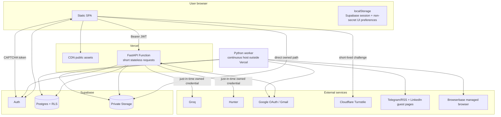
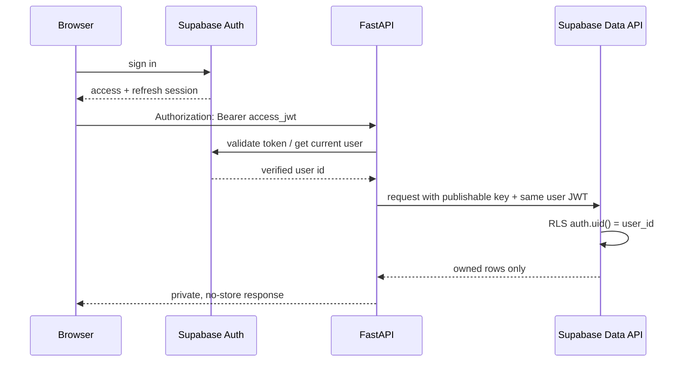
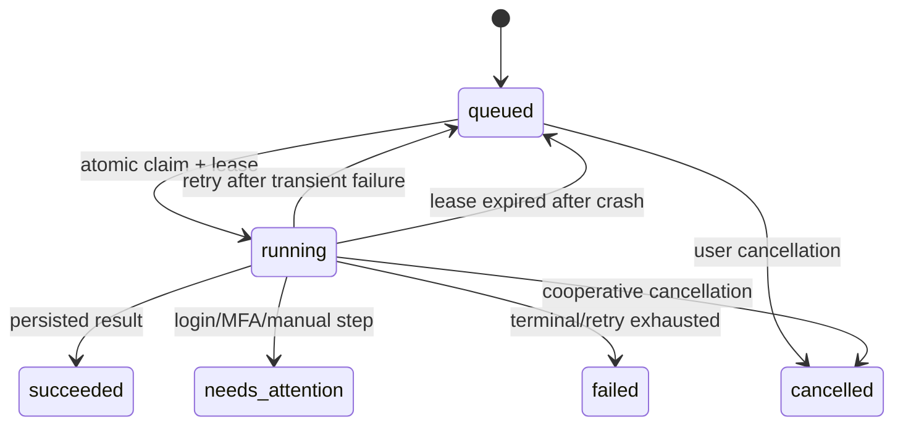

# Architecture

## AutoApply Cloud 2.0

**Status:** Implementation baseline
**Date:** 2026-08-15

## 1. Architectural goals

- Public, authenticated, multi-user service with strict tenant isolation.
- Vercel-compatible stateless web/API execution.
- Durable provider actions with explicit approval and idempotency.
- Bounded tenant-owned discovery using public sources and résumé-derived Groq terms.
- Encrypted account-scoped Groq/Hunter credentials and max-10 outreach orchestration
  without a bulk-send API or deployment-wide Hunter credential.
- Browserbase BYOK per account, preferred over an optional operator fallback, without
  placing browser credentials in queue payloads.
- Immutable form revisions with separate scan/browser-side suggestions and one explicit
  exact-approval submission boundary, followed by verified provider confirmation.
- Direct private résumé storage and per-user provider connections.
- Honest separation between product auth, OAuth authorization, and browser sessions.
- Reuse of the legacy pure matching/safety logic without reusing its global state.

## 2. Deployment view



`WORKER` is a continuously running process on a persistent host outside Vercel. It is
not a Vercel Function, request callback, or best-effort in-process background task.

## 3. Trust boundaries

### Browser

The browser is controlled by the user and is not trusted to assert a `user_id`, status,
approval, quota, or ownership. It holds:

- the Supabase application session managed by `supabase-js`;
- a non-authoritative outreach selection/contact cache capped at 10 jobs;
- UI state that is never authoritative.

The public Turnstile site key may reach the browser; the matching Turnstile secret is
configured only inside Supabase Auth. CAPTCHA tokens protect sign-in, sign-up, and reset
requests and are kept in memory only until the next auth attempt.

### Vercel API

The API validates the Supabase bearer token for each private request, derives the UUID
from its verified subject, and calls Supabase with that user's JWT wherever possible so
RLS remains active. It may use the Supabase secret key only for server-only records such
as OAuth token storage, callback state, and encrypted provider credential access.
`public.user_provider_credentials` is service-role-only; credential responses contain
safe status/hints rather than plaintext or ciphertext.

For the one-time upgrade from legacy browser-local Groq/Hunter keys, the authenticated
client reads only keys namespaced to the current user and submits them through the same
validated PUT API. It removes the legacy value only after a successful encrypted save;
failure retains it for a visible retry. No generation route consumes that legacy value
or accepts it as a fallback header.

No user-bound client, token, application state, rate limiter, or run status is cached in
module globals because a warm Function may serve different users.

### Worker

The worker has elevated credentials and therefore carries the largest blast radius. It
may process only a job atomically claimed from the database. The job's persisted
`user_id` is the sole tenant input; queue messages never nominate a separate user. It
owns bounded public-feed/LinkedIn guest network fetches and all managed-browser work.
Provider navigation and every redirect are checked against explicit HTTPS host
allowlists before content is read.

### Providers

Groq sees the profile/résumé/JD content needed for the requested generation. Hunter sees
the selected owned job's company name during an explicit HR-contact search. Their
account-scoped keys are encrypted at rest and decrypted only for the provider call.
Google sees the OAuth/send
operations the user approved. Managed-browser providers hold opaque browser contexts.
Tokens, cookies, and context connection URLs never reach public rows.
Telegram/RSS and LinkedIn guest discovery use public pages only and receive no user
credentials. LinkedIn guest discovery is unofficial/best-effort and is not connected to
LinkedIn Easy Apply.

## 4. Request authentication



The initial implementation uses the Auth server's current-user endpoint for strong,
simple verification. It can move to cached JWKS verification later without changing the
route dependency contract. That verified response also supplies `last_sign_in_at`;
permanent account deletion fails closed unless it is no more than ten minutes old.
Reauthentication uses the normal Supabase sign-in and Turnstile flow, so AutoApply never
receives the user's password.

## 5. Resume flow

```mermaid
sequenceDiagram
    participant B as Browser
    participant S as Supabase Storage
    participant API as FastAPI
    participant DB as Postgres
    B->>S: upload user-id/resume-[1-5].pdf with user JWT
    S->>S: Storage RLS checks exact owner + slot + five-object cap
    B->>API: register owned slot + safe metadata
    API->>DB: RPC verifies object; lock user; deactivate old; activate selected
    B->>API: parse selected resume
    API->>S: download after owner/path check
    API->>API: validate PDF and extract text
    API->>DB: save parsed text + suggestions
    API-->>B: suggestions; no silent overwrite
```

Temporary parse files, if required, use `/tmp` and are discarded after results are
written to Supabase.

Registration is one database transaction, so concurrent tabs cannot leave multiple
active résumés. The five fixed filenames also let Storage uniqueness enforce the hard
object cap. Deletion removes the selected object and its `resumes` row only; application
history has no cascading résumé foreign key and is retained.

## 6. Account-scoped provider credential flow

```mermaid
sequenceDiagram
    participant B as Browser
    participant API as FastAPI
    participant DB as Service-only credential table
    participant G as Groq
    B->>API: JWT + PUT /provider-credentials/groq + key
    API->>G: minimal validation
    G-->>API: valid provider response
    API->>API: encrypt versioned JSON payload
    API->>DB: service-role upsert by verified user + provider
    API-->>B: safe status + masked hint only
    B->>API: JWT + job/application id
    API->>DB: load owned ciphertext with service role
    API->>API: decrypt just in time; load owned profile/résumé/JD
    API->>G: completion request with owned key
    G-->>API: generated draft
    API->>API: validate/normalize and persist draft, never credential
    API-->>B: editable draft
```

`GET /api/v1/provider-credentials` exposes status for `groq`, `hunter`, and
`browserbase`; `PUT` and `DELETE /api/v1/provider-credentials/{provider}` replace or
remove only the verified user's row. The API sanitizes provider errors so a key cannot
be reflected. `TOKEN_ENCRYPTION_KEY` protects each versioned JSON payload before the
service-role-only write. The browser receives neither plaintext nor ciphertext.

The same boundary applies to résumé-guided planning: the API loads the owned parsed
résumé/profile, decrypts the owned Groq credential just in time, reduces the provider
response to bounded roles/keywords, and only then enqueues those small terms. Neither
résumé text nor any provider credential enters an automation payload. Normal sign-out
leaves account credentials intact; explicit provider removal or account deletion
removes their rows.

## 7. Credential-free discovery flow

```mermaid
sequenceDiagram
    participant B as Browser
    participant API as FastAPI
    participant DB as Postgres
    participant W as Worker
    participant P as Public source
    alt resume-guided search
      B->>API: JWT + bounded options
      API->>DB: resolve owned encrypted Groq credential
      API->>API: derive roles/keywords from owned parsed resume
      API->>DB: enqueue LinkedIn guest + Telegram/RSS jobs; no key/resume text
      W->>DB: claim tenant jobs with leases
      W->>P: bounded public-source requests
      W->>W: filter Telegram/RSS by derived terms
      W->>DB: normalize/upsert owned matching jobs
      API-->>B: inspectable plan + two redacted jobs
    else pasted referral digest or CSV/XLSX
      B->>API: bounded untrusted text/file
      API->>API: parse, normalize, detect provider
      API->>DB: upsert owned jobs by normalized URL
      API-->>B: imported/duplicate/rejected counts
    else Telegram/RSS, LinkedIn guest, or public ATS board search
      B->>API: owned discovery preferences + explicit run
      API->>DB: enqueue bounded discovery job
      W->>DB: claim job with user ID + lease
      W->>P: allowlisted HTTPS request with byte/item/page limits
      W->>DB: normalize/upsert owned jobs; persist redacted result
      B->>API: poll owned job/result
      API-->>B: reviewable discoveries
    end
```

Discovery preferences and results are tenant-owned. A normalized URL is the idempotency
boundary when available. Pasted/imported strings are rendered through `textContent` and
never trusted as markup. CSV/XLSX parsing has file, row, and cell ceilings and does not
execute formulas or macros.

Telegram preview/RSS fetching uses a fixed source catalog and redirect revalidation;
job URLs found in content are stored for review, not fetched arbitrarily. LinkedIn guest
search has small page/result limits and stops on throttling or challenge responses. It
does not create or reuse a LinkedIn login context and cannot queue Easy Apply.
Greenhouse, Lever, and Ashby board discovery derives a fixed official API URL from the
hosted board identifier, fetches no user-selected destination, and interleaves bounded
results when multiple company boards are supplied.

`GET /api/v1/discovery/google-forms` is a read model over the authenticated user's jobs
and latest applications. It combines direct Google Forms job URLs with form URLs nested
in discovery metadata, normalizes and deduplicates URLs, emits stable queue IDs, and
paginates the result. A queue read has no automation side effect. A metadata-only form
must first be saved as a job; scan, immutable-revision review, explicit approval-bound
submission, verified confirmation, and any needs-attention Browserbase Live View
fallback retain their explicit boundaries.

## 8. Gmail OAuth and send flow

```mermaid
sequenceDiagram
    participant B as Browser
    participant API as FastAPI
    participant DB as Postgres
    participant G as Google
    opt Advanced user-managed OAuth client
        B->>API: save Web client ID + secret
        API->>DB: encrypt both; service-role-only upsert; advance credential generation
    end
    B->>API: authenticated Connect Gmail (platform default or explicit user client)
    API->>DB: advance lifecycle; store one-time state bound to user + source/generation
    API-->>B: Google authorization URL
    B->>G: consent to identity + gmail.send
    G->>API: callback(code, state)
    API->>DB: consume state atomically
    API->>DB: resolve only the state-bound encrypted client
    API->>G: exchange code using that Web client + the fixed callback
    G-->>API: tokens + account identity
    API->>DB: save only if generation is current; encrypt tokens; upsert connection
    API-->>B: redirect to app
    B->>API: approve and send application + idempotency key
    API->>DB: reserve tenant + pseudonymous provider limits transactionally
    API->>G: users.messages.send with owned resume
    G-->>API: provider message/thread id
    API->>DB: finalize send and audit event
    API-->>B: sent result
```

### Reviewed outreach orchestration

```mermaid
sequenceDiagram
    participant B as Browser
    participant API as FastAPI
    participant H as Hunter
    participant Q as Groq
    participant G as Gmail
    B->>B: select 1-10 owned jobs
    B->>B: review inline Hunter credit estimate; click Find contacts
    loop selected jobs, sequentially
      B->>API: JWT + owned job ID
      API->>API: resolve/decrypt owned Hunter credential
      API->>H: HR domain search with owned key/company
      H-->>API: bounded contacts
      API-->>B: allowlisted contact fields
      B->>B: choose one contact
    end
    loop selected jobs, sequentially
      B->>API: set chosen recipient; JWT + draft request
      API->>API: resolve/decrypt owned Groq credential
      API->>Q: grounded generation with owned key
      API-->>B: editable application draft
    end
    B->>API: approve each exact application revision separately
    B->>B: explicit final send confirmation
    loop at most 10 approved applications, sequentially
      B->>API: single application send + unique idempotency key
      API->>API: enforce daily/duplicate/provider/idempotency gates
      API->>G: one users.messages.send
      API-->>B: per-message result
    end
```

Hunter validation and owned-job contact search
(`POST /api/v1/jobs/{id}/contacts/hunter`) remain explicit foreground operations. The
provider adapter resolves the encrypted account credential server-side; contacts remain
non-authoritative UI state until the chosen email is explicitly saved on the owned job.
The server exposes no Hunter queue or deployment-wide key.

Only single reviewed sends run in the web function. The max-10 “batch” is a bounded UI
loop over that existing endpoint, not a bulk-mail API: approval remains per exact
message, the user confirms again before sending, and every sequential call independently
passes the same daily, duplicate-recipient, provider-account, and idempotency
reservation gates. Delayed or autonomous sending is not implemented.

The operator-managed OAuth client is the normal/default source when configured. The
advanced user-managed path stores an authenticated user's Web client ID and secret in
`user_google_oauth_clients`, encrypted before the service-role write. Browser roles
have no table policy or grant, and status never returns the saved secret. Both sources
use the single fixed `GOOGLE_REDIRECT_URI`; users cannot provide redirect URIs, scopes,
or Google endpoints. A Google Cloud API key cannot replace a Web OAuth client.

`connection_lifecycles` serializes Gmail start, callback, reconnect, disconnect, and
user-client changes. A new start increments the lifecycle generation and removes prior
states. Each state also records `credential_source` and the user client's generation,
when applicable; callback exchange and token refresh resolve only that binding. Saving,
replacing, or deleting a user client advances its credential generation and invalidates
pending states, and is rejected until Gmail is disconnected and no provider send is in
flight. Beginning disconnect also advances/locks the lifecycle before calling Google.
A stale callback therefore cannot recreate a newer/disconnected connection or switch
OAuth clients. Disconnect deletes local connection/token rows even if Google's
revocation endpoint is unavailable; revocation is best-effort and the UI directs the
user to Google Account controls when it is not confirmed. Disconnect does not by itself
delete a saved user-managed OAuth client; the user can delete it afterward.

Google-project lifecycle is outside AutoApply's database lifecycle. An External project
in Testing must explicitly list test users; with `gmail.send`, its grants and refresh
tokens expire seven days after consent. The project owner must publish and complete
brand/domain and sensitive-scope verification before using that client as a public
production app.

Send reservation hashes `gmail:<Google subject>` and the normalized recipient with
domain-separated SHA-256. A server-only `provider_send_events` row has no user ID,
plaintext email, body, or token. It serializes provider-account reservations, applies a
25-send rolling 24-hour ceiling and the configured duplicate window even after account
recreation, and expires no later than 90 days. Account deletion removes tenant send
history but deliberately leaves only these bounded hashes until their expiry. Expired
rows stop participating immediately; an hourly service-only database job and the
reservation hot path physically delete them. Physical deletion can lag logical expiry
if cron fails, so the job's run history is monitored.

## 9. Managed-browser application flow

The sequence below applies only to a provider whose application handler has been
enabled after its capability and staging gates pass; registry-only connections never
enter the fill or submit stages. This sequence shows the one-page Google Forms path. The
user authorizes one exact revision; the worker performs the bounded submit and success
requires freshly observed provider confirmation.

```mermaid
sequenceDiagram
    participant B as Browser
    participant API as FastAPI
    participant DB as Postgres
    participant W as Worker
    participant BB as Browserbase
    B->>API: request scan for owned application/job
    API->>DB: enqueue application_scan
    W->>BB: open isolated provider context; inspect fields only
    W->>DB: append immutable form revision + schema/content hashes
    B->>API: poll owned scan; load exact revision in Form Pilot
    B->>API: automatically request grounded suggestions
    API->>DB: resolve owned encrypted Groq credential
    API-->>B: draft answers only; no DB mutation or approval
    B->>B: review/edit every answer in Form Pilot
    B->>API: Approve & submit exact revision + expected hashes
    API->>DB: seal latest exact revision; validate required-answer preflight
    API->>DB: enqueue idempotent application_submit
    W->>BB: revalidate URL/schema/approval; fill only sealed values/resume
    W->>BB: activate one unambiguous Submit control; await fresh confirmation
    alt confirmation observed
      W->>DB: application_submitted + submission_state=confirmed
      API-->>B: verified submitted result
    else login/challenge/schema/required field/uncertain result
      W->>DB: needs_attention; no blind retry
      API-->>B: explanation + optional allowlisted Live View fallback
    end
```

The adapter registry contains `google_forms`, `greenhouse`, `lever`, `ashby`, `yc`,
`wellfound`, `cutshort`, and `instahyre`. ZipRecruiter is absent. Registry membership
provides provider identity, host/redirect policy, and an isolated Browserbase context;
it does not assert that every provider has an end-to-end application state machine.
Greenhouse has an aligned managed-browser handler. One-page Google Forms have aligned
scan, exact-approved submit, and verified-confirmation handling; multi-page or branching
Google Forms are unsupported. Lever and Ashby have safe mappings with read-only live
scan evidence but still require controlled submit canaries; Wellfound still needs a
signed-in canary. YC has a finished exact-job state machine but remains operator-
allowlist gated until its signed-in canary passes. The exact-host generic company-form
adapter remains an internal controlled canary rather than an enabled public capability.
Cutshort and Instahyre remain connection-only until tenant-aware multi-step state
machines are implemented. Public forms may use an ephemeral session; login-gated
providers reuse an encrypted
`(user_id, provider)` context. A single active lease may use a persisted context.

Scanning/suggestions and the external submission authorization are intentionally
separate. A revision binds the target URL, detected form schema, and selected résumé.
After the scan, the signed-in browser automatically calls the existing suggestion
endpoint once for that revision when the account has a usable Groq credential. The key
never enters the durable queue; the user still reviews the returned draft answers in
Form Pilot.
The explicit combined action atomically seals the exact answers reviewed in the browser
and queues their submit. Any post-approval answer change, or any URL/résumé/schema
change, requires a new revision. The worker requires complete required answers, activates
exactly one provider Submit control, and recognizes success only from a fresh
confirmation signal. CAPTCHA, MFA, login expiry, unknown required fields, changed
schema, or uncertain confirmation produce `needs_attention`; Live View is offered only
for that fallback and the worker never bypasses, guesses, or blindly retries.

YC uses the same immutable-review boundary with a stricter target contract. The user
must first save one exact current public YC job-detail URL; search, company-listing,
account, generic application, and unsupported historical URLs never enter the browser
queue. YC-owned roots and subdomains are reserved from the generic company-form adapter,
so that adapter cannot weaken the exact-job boundary. The user signs in inside a
tenant-isolated persistent Browserbase BYOK context.
Playwright in the continuously running worker outside Vercel controls Browserbase,
opens only that bound job, scans its visible fields, and creates a résumé/Groq-grounded
revision for review. A sealed revision authorizes one unique submit action, and success
requires a fresh YC confirmation. Vercel never launches Chromium or runs this worker.
Optional YC query, remote, and limit preferences are tenant display/matching state only;
they do not issue provider requests, scrape/discover jobs, or authorize bulk apply.

Mass Cold Email is a separate email-channel workflow. Its Build campaign and Review &
send subtabs never render ATS/form revisions; all Google Form answers, approval state,
submit progress, verification, and attention fallback remain in Form Pilot.

## 10. Durable worker protocol



The queue is initially a Postgres table and claim RPC using `FOR UPDATE SKIP LOCKED`.
This is portable and easy to deploy. It may later be fed by Vercel Queues without
changing job semantics.

Idempotency boundaries:

- unique `(user_id, normalized_url)` for owned jobs;
- unique `idempotency_key` per user/job type;
- unique provider send reference after Gmail accepts a message;
- one running browser job per connection/context;
- one immutable form revision/hash approval and deterministic submit idempotency key per
  worker-submit request;
- terminal transitions compare the worker lease token.

The outreach selection and returned Hunter contacts are deliberately not new durable
job kinds or idempotency boundaries. They are capped browser state; persistence begins
only when the user chooses a recipient/creates an application, and every Gmail send
uses the existing per-application reservation.

Durable job kinds include `discover_public_feeds`, `discover_linkedin_guest`,
`discover_public_ats`, `application_scan`, `application_prefill`, and
`application_submit`, plus the existing manual handoff/control jobs.

## 11. Connection modes

| Mode | Meaning | Examples |
|---|---|---|
| `oauth` | Official provider authorization | Gmail send |
| `public_ats` | Recognized application URL or explicit public company-board enumeration; no account secret required | Google Forms, Greenhouse, Lever, Ashby |
| `managed_browser` | Isolated remote context; provider must be allowlisted | Google Forms, Greenhouse, Lever, Ashby, YC, Wellfound, Cutshort, Instahyre |
| `manual_only` | Product tracks and opens the external page | Any unsupported board |
| `partner_required` | Official approval/API agreement is required | LinkedIn candidate apply |

LinkedIn application handling is manual/partner-only. The separate unofficial guest-job
adapter is discovery-only: no LinkedIn OAuth, account context, Easy Apply fill, or submit
is claimed. Even a future identity-only OIDC link would not grant candidate application
access.

`managed_browser` describes the connection mechanism, not application completeness.
The initial production allowlist is `google_forms,greenhouse` after their controlled
staging checks. Google Forms means scan, exact review, one explicit approval-bound
background submit, and verified confirmation; Live View is only a needs-attention
fallback. Lever, Ashby, and Wellfound are added one at a time only after canaries. YC
has a finished exact-job state machine but remains outside the allowlist until a
controlled signed-in exact-job canary passes. After that canary, add it explicitly, for
example `ALLOWED_BROWSER_PROVIDERS=google_forms,greenhouse,yc`. Cutshort and Instahyre
remain outside until their multi-step handlers exist. The
generic exact-host company-form adapter is internal/gated and is not a public catalog or
allowlist entry. The Google Forms entry is limited to one-page forms.

Managed-browser connection flow:

1. API confirms the provider is one of the eight registry entries and is operator
   allowlisted, then resolves the account's Browserbase BYOK pair or optional platform
   fallback.
2. For BYOK setup, the API validates the API-key/Project-ID pair with Browserbase
   `GET /v1/projects/{project_id}` and requires the returned ID to match. This read-only
   check creates no session and consumes no browser minute.
3. The runtime creates a context/session with the chosen credential and returns a
   short-lived Live View URL when user attention is required.
4. The user types credentials/MFA directly into that remote browser.
5. The session closes immediately after completion; only its opaque context ID remains
   in server-only metadata.
6. Worker jobs reuse that context while enforcing a connection lock and exact revision
   approval.

The worker prefers the claimed job owner's encrypted Browserbase credential.
`BROWSERBASE_API_KEY` and `BROWSERBASE_PROJECT_ID` are optional operator fallback
credentials shared only by trusted API/worker environments. Browser sessions use a
90-second stall cap but close earlier on success. Browserbase applies a one-minute
minimum billing period per created session, so a sub-minute run still consumes at
least one browser minute; the shorter cap saves usage only when work would otherwise
stall longer. New users can create an account at
<https://www.browserbase.com/sign-up>, then copy the API key and Project ID from
<https://www.browserbase.com/settings> or <https://www.browserbase.com/overview>.

Gmail's
optional `GOOGLE_CLIENT_ID`/`GOOGLE_CLIENT_SECRET` provide the default platform OAuth
client; `GOOGLE_REDIRECT_URI` remains required for both platform- and user-managed
Gmail OAuth. None of these settings authorize Google Forms.

## 12. Data architecture

All tenant tables use UUIDs, `timestamptz`, `created_at`/`updated_at`, an indexed
`user_id`, foreign keys with deliberate cascade behavior, and RLS. Visible integration
metadata is separated from encrypted provider secrets. Storage is private.

The exceptions are server-only lifecycle/secret records, including encrypted
`user_google_oauth_clients`, encrypted `user_provider_credentials`, and the pseudonymous
Gmail abuse ledger. Browser roles have no grants on them. Provider credentials are
unique by `(user_id, provider)` for `groq`, `hunter`, and `browserbase`; their versioned
JSON payload, status metadata, and masked hint are accessed only through authenticated
API methods backed by the service role. Lifecycle/secret/user-client records cascade with the account;
provider-abuse rows have no account foreign key so caps cannot be
reset by deleting/recreating an account, but their schema enforces a 90-day maximum
expiry. An hourly database job plus reservation traffic prunes expired rows.
Cron failure does not reactivate an expired row, but it can delay physical deletion and
therefore requires an operational alert and remediation.

The worker's secret key bypasses RLS, so repository methods require `user_id` even when
the primary key is globally unique. This defense prevents accidental cross-tenant work.

`discovery_preferences` stores per-user source/query bounds. `application_form_revisions`
uses appended revisions whose identity/schema payload is immutable; first approval
seals the reviewed answers, while bounded lifecycle/result fields may advance. Each row
binds provider, URL, field schema, answers, résumé, hashes, and approval.
`automation_jobs.form_revision_id` ties browser work to the reviewed record instead of
accepting answers in an untrusted queue payload. Browser roles may read their own
revisions and invoke the exact-approval RPC; worker mutations use service-only
bundle/scan/progress RPCs.

Profile facts use two deliberately different résumé representations. The uploaded PDF
and its Storage path remain private application evidence. `profiles.resume_url` is a
separate user-provided public HTTPS link for employer-visible résumé/CV URL questions;
it is never inferred from the private object or replaced with an expiring signed URL.
Recognized graduation/passout questions map deterministically to
`profiles.graduation_year`; recognized résumé-link questions map only to
`profiles.resume_url`, before Groq handles open-ended questions.

The schema transition is forward-only: migration `202608130001` was the temporary
Google Forms submit prohibition, `202608130002` removes that prohibition and installs
the exact-approved required-answer submit gate, and `202608130003` adds the public
résumé URL fact. Deployments must apply all three in order and must not stop at the
temporary `001` state.

## 13. Legacy component disposition

| Legacy component | Hosted disposition |
|---|---|
| `app/logic.py` safety math | Reuse pure functions |
| Prompt and field-matching logic | Generalize and inject user profile |
| SQLite `app/db.py` | Replace with Supabase REST/Postgres migration |
| Root `.env`, `profile.json`, `cv.pdf`, token files | Never load in hosted mode |
| APScheduler / FastAPI `BackgroundTasks` | Replace with durable jobs |
| `LAST_*`, stop flags, cached clients | Replace with rows/leases; no user globals |
| Shared `digest_seen.json` / import files | Replace with tenant rows and normalized URL idempotency |
| Legacy public discovery parsers | Reuse only bounded pure normalization; move network work to worker |
| Desktop Gmail `InstalledAppFlow` | Replace with web OAuth |
| Local `.browser_profile` | Optional managed context or user companion |
| Legacy ZipRecruiter integration | Do not migrate into hosted catalog or worker |
| Static dashboard concepts | Replace with authenticated SaaS SPA |
| Local CLI/scripts | Legacy/worker development only |

## 14. Failure and recovery

- API errors preserve correct status codes and stable error identifiers.
- Provider timeouts never become successful terminal states.
- OAuth state is single-use; token exchange failure leaves no connected status.
- OAuth generations make superseded callbacks stale, including callbacks racing a
  disconnect. Failed Google revocation does not preserve local token rows.
- OAuth credential bindings prevent a callback or refresh from falling back to another
  client. A missing/corrupt/stale user client requires reconfiguration/reconnection;
  it is never replaced by the platform secret implicitly.
- A send reservation has `pending_provider`, `sent`, or `failed` state. Ambiguous Gmail
  timeouts are reconciled before retry rather than blindly repeated.
- Worker retries use bounded exponential backoff and a maximum attempt count.
- CAPTCHA/security/MFA is `needs_attention`; workers never attempt bypass.
- A changed form schema/revision invalidates approval and requires a new review.
- A queued/running/prefill result is never submission success. Google Forms succeeds only
  with `application_submitted` plus `submission_state=confirmed`. Any ambiguous
  worker-submit state is `needs_attention`, may expose an allowlisted Live View, and is
  not blindly retried.
- LinkedIn guest/public-feed throttling produces a bounded retry or visible partial
  result, never an unbounded crawl.
- A missing/invalid/quota-exhausted Hunter key returns a redacted foreground error; it
  never falls back to another account or a deployment key and never turns the lookup
  into unattended work.
- A missing, mismatched, corrupt, or undecryptable Browserbase BYOK pair falls back only
  to explicitly configured platform credentials; if no source is available, the job
  fails closed before session creation. Completed sessions close immediately and stalled
  sessions stop at 90 seconds.
- Résumé-guided planning fails before enqueue when there is no parsed active résumé or
  usable search evidence. A public-source partial failure remains visible on its owned
  durable job.
- The outreach loop reports results per message and stops safely on hard Gmail quota or
  reauthorization errors; it does not replay successful sends or bypass an individual
  approval/duplicate/idempotency gate.
- A provider policy/configuration mismatch is a capability error, not a retry loop.

## 15. Security posture required for a public product

The instruction to disregard privacy cannot be applied to a public Gmail/Supabase
product. Provider policies and basic tenant safety require least scopes, a privacy
notice, secure token storage, RLS, deletion, log redaction, and verified consent. These
controls are architectural requirements, not optional polish.

Production promotion additionally requires an actual staging Supabase migration plus
RLS, Storage, OAuth-generation, send-reservation, deletion, and worker concurrency
tests; verified Vercel/Supabase production settings; Google verification for the exact
domain and scopes of the public platform client, plus accurate Testing/verification
guidance for user-managed project owners; `TOKEN_ENCRYPTION_KEY`; an account BYOK or
optional platform Browserbase credential; a persistent worker;
live provider testing
with controlled accounts/jobs; and reviewed operator-specific legal/contact pages. The
generic placeholders in this repository are explicit launch blockers, not inferred
defaults. Mocked browser tests demonstrate deterministic worker behavior, not that a
third-party provider's current production markup or terms have been validated.
